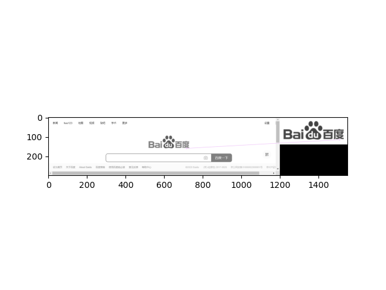

# 667788项目 动态爬虫+logo识别

# 实现原理

   使用seleniumrequests和OpenCV，开发的引擎，调用方法在Main.py之中。

# 目录结构：

- 667788 
  baidu.png 
  main.py 
  - api_lib 
    - chromedriver_linux64 
         chromedriver 
    - chromedriver_mac64 
         chromedriver 
    - chromedriver_win32 
         chromedriver.exe 
  - py_lib 
      dynamic_crawler.py 
      env_settings.py 
      logo_recognition.py 
      random_str.py 

# 环境搭建

需要指定谷歌浏览器版本 谷歌浏览器：86.0.4209.2 win32 

使用pip install -r requirements.txt 安装，可能会提示找不到模块，则需要去模块官网下载对应版本。

# 使用方法

启动：Python main.py 

样本在设置在 logo_recognition.LogoRec().test_xfeatures2d(key, "baidu.png")

目标站点设置在 dynamic_crawler.RequestsHttp(url="https://www.baidu.com/").requests_get()

# 识别结果

## 样本

## 识别情况

